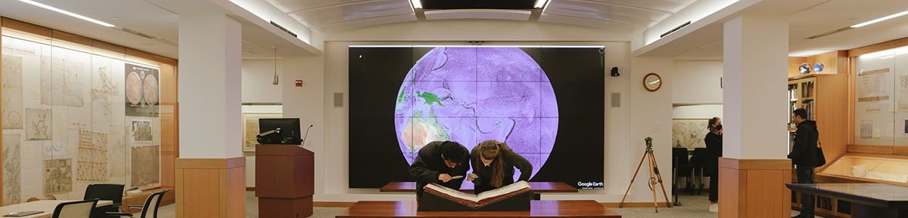

# Welcome to the David Rumsey Map Center's GitHub Organization! 

Welcome to the official GitHub profile of the David Rumsey Map Center. We're dedicated to making Stanford Library's historical cartographic collections discoverable, useful, and meaningful.

## 🌟 Projects

We're just getting started here, and so far most of our projects are used for internal purposes. For example:

- **Presentations**: We store Reveal.js presentations here - [github.com/davidrumseymapcenter/presentations](https://github.com/davidrumseymapcenter/presentations)
- **QR Code Menu**: We use this as a quick reference to more info - [bit.ly/drmc-qr-menu](https://davidrumseymapcenter.github.io/qr-code-menu/)
- **California Map Society Student Competition**: We advertise a student competition here: [davidrumseymapcenter.github.io/cms-studentcompetition/](https://davidrumseymapcenter.github.io/cms-studentcompetition/)

Check out more of our projects [here](https://github.com/orgs/davidrumseymapcenter/repositories).

## 💡 How to Contribute

We welcome contributions! Here are a few ways you can help:

- **Report bugs or request edits**: Use the issue tracker in the relevant project repository.
- **Support us**: Star our repositories, share our projects, or [donate](https://library.stanford.edu/support-stanford-libraries).

## 📫 Contact Us

- **Email**: rumseymapcenter@stanford.edu

## 🤝 Stay Connected

Stay up to date with our latest news and projects by signing up for [our monthly newsletter](https://stanford.us14.list-manage.com/subscribe?u=bc280d099b8c85ba9fd6e0bb0&id=3f16ea62b6).

Thank you for visiting us on GitHub! 🌈
